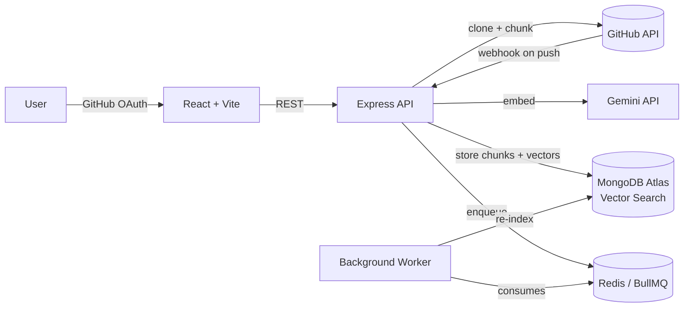

# CodeAtlas

Ask natural-language questions about any GitHub repository and get grounded, cited answers — not guesses. Connect a repo, CodeAtlas clones and chunks it respecting function/class boundaries, embeds the code, and answers your questions with real file/line citations pulled from an Atlas Vector Search index.


## Why this exists

Most "chat with your codebase" tools either hallucinate confidently or bury you in raw search results. CodeAtlas is built around one constraint: **every claim in an answer must trace back to a real, retrievable chunk of code** — proven with an eval harness, not just eyeballed.

## Features

- **GitHub OAuth** — sign in with your GitHub account
- **Multi-repo support** — connect and switch between several of your own repos
- **Structure-aware chunking** — a regex-based parser that respects function/class/factory-call boundaries (e.g. Redux `createSlice`), not fixed-size splits
- **Semantic search** — Gemini embeddings + MongoDB Atlas Vector Search
- **Grounded, cited chat** — streaming answers with inline `[1]` references that map to real file paths and line numbers, filtered to only what the model actually cited
- **Webhook-based re-indexing** — a `git push` to the default branch automatically triggers a background re-index via a BullMQ/Redis job queue, verified with HMAC-signed GitHub webhooks
- **3D dependency graph** — visualizes real import relationships between files (React Three Fiber)
- **Developer tools** — dedicated Chunk Explorer and raw Vector Search pages for inspecting retrieval directly

## Retrieval quality

Measured with a 10-query eval harness (`pnpm eval`) against a real indexed repo:

| Metric | Result |
|---|---|
| Hit rate @ top-8 | 100% (10/10) |
| Mean Reciprocal Rank | 0.792 |

## Architecture



## Tech stack

| Layer | Choice |
|---|---|
| Monorepo | pnpm workspaces, TypeScript |
| Frontend | React, Vite, Tailwind CSS, shadcn/ui, React Three Fiber |
| Backend | Node.js, Express 5 |
| Database | MongoDB Atlas + Atlas Vector Search |
| Embeddings / LLM | Google Gemini (`gemini-embedding-001`, `gemini-3.6-flash`) |
| Job queue | BullMQ + Redis |
| Auth | GitHub OAuth |

## Getting started

```bash
pnpm install
pnpm build:shared
```

Requires `.env` files in `apps/api` for MongoDB, GitHub OAuth, Gemini, and Redis credentials — see `apps/api/.env.example`.

```bash
pnpm dev:api      # backend
pnpm dev:web      # frontend
pnpm dev:worker   # background indexing worker
```

## Testing

```bash
pnpm test         # unit tests (chunker, dependency graph resolution)
cd apps/api && pnpm eval <repoId>   # retrieval quality eval
```

## Known limitations

- Chunking is regex-based, not full AST parsing — reliable for JS/TS, imprecise for other languages
- No conversation memory — each chat question is answered independently
- Dependency graph resolves relative imports only, not path aliases or external packages